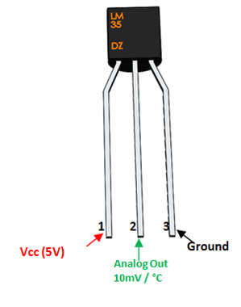

# LoRaWAN workshop

In this session you'll be building five examples, introducing you to:

1. Building IoT devices with [Arm Mbed OS](https://os.mbed.com/).
1. Hooking up a thermistor to a development board.
1. Connecting your device to [The Things Network](https://www.thethingsnetwork.org/) using LoRaWAN.
1. Data visualization of temperature sensors.

In case you're stuck this document will help you get back on track. If you're a fast learner, there are 'extra credit'-assignments at the end of each section. Please help your neighbours as well :-)

## Prerequisites

1. Create an Arm Mbed online account [here](https://os.mbed.com/account/signup/).
1. Then install the following software for your operating system below.

**Windows**

If you are on Windows, install:

1. [ST Link](http://janjongboom.com/downloads/st-link.zip) - serial driver for the board.
    * Run `dpinst_amd64` on 64-bits Windows, `dpinst_x86` on 32-bits Windows.
    * Afterwards, unplug your board and plug it back in.
    * (Not sure if it configured correctly? Look in 'Device Manager > Ports (COM & LPT)', should list as STLink Virtual COM Port.
1. [Tera term](https://osdn.net/projects/ttssh2/downloads/66361/teraterm-4.92.exe/) - to see debug messages from the board.
1. [Node.js](https://nodejs.org/en/download/) - to show visualizations.

**Linux**

If you're on Linux, install:

1. screen - e.g. via `sudo apt install screen`
1. [Node.js](https://nodejs.org/en/download/) - to show visualizations.

**MacOS**

If you're on MacOS, install:

1. [Node.js](https://nodejs.org/en/download/) - to show visualizations.

## Building the circuit

We're using the [NUCLEO-L476RG](https://os.mbed.com/platforms/ST-Nucleo-L476RG/) development board, a Semtech SX1272 LoRa shield, a thermistor (to measure temperature) and a breadboard. Let's build a circuit.

Grab the following items:

* Development board.
* LoRa shield.
* Mini-USB cable.
* 3x jumper wires.
* Thermistor.
* Breadboard.

## Hooking it up to the NUCLEO board



This is the LM35 pinout. Place it on a breadboard, and connect three wires to it. Make sure the orientation is correct!


This is the pinout of the *LEFT* side of the NUCLEO board (you should heva the USB connnection on the top). Connect:

* Thermistor power -> RED.
* Thermistor ground -> BLACK.
* Thermistor data -> YELLOW.

**If the thermistor gets hot, you did something wrong ;-)**

## 1. Some simple applications in the simulator

There is an Mbed simulator which you can use to test things out quickly. Let's build some small examples:

1. Go to [the simulator](http://labs.mbed.com/simulator/).
1. Load `Blinky`.

This blinks the LED every 500 ms. We can make it dependend on an input signal as well. For example, place the following code in the editor and click *Compile*.

```
#include "mbed.h"

DigitalOut led(LED1);
DigitalIn btn(BUTTON1);

int main() {
    while (1) {
        led = btn.read() ? 1 : 0;
        printf("Blink! LED is now %d\n", led.read());

        wait_ms(500);
    }
}
```

This turns the LED on when you press the on-board button. However this is inefficient as the microcontroller needs to keep checking the state of the button. We can also an 'interrupt' to detect this instead.

```cpp
#include "mbed.h"

DigitalOut led(LED1);
InterruptIn btn(BUTTON1);

void fall() {
    led = !led;
}

int main() {
    btn.fall(&fall);
}
```

Now the MCU can go to sleep automatically in between actions. A downside of this is that your `fall` function now runs in an ISR, and some things are not safe in an ISR such as calling `printf` (because it's guarded by Mutex'es). This is not an issue in the simulator, but it will be on the board. We can use an EventQueue to prevent this and automatically debounce the interrupt event:

```cpp
#include "mbed.h"
#include "mbed_events.h"

EventQueue queue;

DigitalOut led(LED1);
InterruptIn btn(BUTTON1);

void fall() {
    led = !led;
    printf("LED is now %d\n", led);
}

int main() {
    btn.fall(queue.event(&fall));

    queue.dispatch_forever();
}
```

Let's use some components:

1. Click *Add component*.
1. Select 'Red LED', and pin `p5` - Click *Add component*.
1. Click *Add component* again.
1. Select 'Analog Thermistor* and pin `p15` - Click *Add component*.

Now place the following code:

```cpp
#include "mbed.h"
#include "mbed_events.h"

AnalogIn thermistor(p15);
DigitalOut led(p5);

EventQueue queue;

void check_temperature() {
    uint16_t samples = 30;
    float allReadings = 0.0f;
    for (uint16_t ix = 0; ix < samples; ix++) {
        allReadings += thermistor.read();
    }

    float tempC = allReadings / static_cast<float>(samples) / 5.0f * 1000.0f;
    led = tempC > 20.0f ? 1 : 0;
    printf("Temperature is %f\n", tempC);
}

int main() {
    queue.call_every(100, &check_temperature);

    queue.dispatch_forever();
}
```

Click *Run* and observe what you see.

## 2. Running it on the real board

Now let's run it on an actual board.

1. Go to [https://os.mbed.com](https://os.mbed.com) and sign up (or sign in).
1. Go to the [NUCLEO-L476RG](https://os.mbed.com/platforms/ST-Nucleo-L476RG/) platform page and click *Add to your Mbed compiler*.
1. Import the example program into the Arm Mbed Compiler by clicking [this link](https://os.mbed.com/compiler/#import:/teams/mbed-os-examples/code/mbed-os-example-blinky/).
1. Click *Import*.
1. In the top right corner make sure you selected 'NUCLEO-L476RG'.

This has cloned blinky.

1. Open `main.cpp` and replace with:

    ```cpp
    #include "mbed.h"

    DigitalOut led(LED1);

    int main() {
        while (1) {
            led = !led;
            printf("Blink! LED is now %d\n", led.read());

            wait_ms(500);
        }
    }
    ```

1. Click *Compile*.
1. 1. A binary (.bin) file downloads, use drag-and-drop to drag the file to the NODE_L476RG device (like a USB mass storage device).

    **Note:** Here's a [video](https://youtu.be/L5TcmFFD0iw?t=1m25s).

1. When flashing is complete, hit the **RESET** button on the board (next to USB).

You should see the blue LED blink very fast. Your first program is running! Let's look at the logs now.

Look at the examples you ran in the simulator, you can run them on the board too; just replace the code in `main.cpp`. Also:

1. Replace `p5` with `LED1` (or hook up an LED to your board).
1. Replace `p15` with `A2` (because we hooked this up to a different pin on the physical board).

## 3. Showing logs

If all is well, you should see something similar to:

```
Blink! LED is now 1
Blink! LED is now 0
Blink! LED is now 1
Blink! LED is now 0
Blink! LED is now 1
```

#### Windows

To see debug messages, install:

1. [Arm Mbed Windows serial driver](http://os.mbed.com/media/downloads/drivers/mbedWinSerial_16466.exe) - serial driver for the board.
    * See above for more instructions.
    * No need to install this if you're on Windows 10.
1. [Tera term](https://osdn.net/projects/ttssh2/downloads/66361/teraterm-4.92.exe/) - to see debug messages from the board.

When you open Tera Term, select *Serial*, and then select the Mbed COM port.


#### macOS

No need to install a driver. Open a terminal and run:

```
screen /dev/tty.usbm            # now press TAB to autocomplete and then ENTER
```

To exit, press: `CTRL+A` then `CTRL+\` then press `y`.

#### Linux

If it's not installed, install GNU screen (`sudo apt-get install screen`). Then open a terminal and find out the handler for your device:

```
$ ls /dev/ttyACM*
/dev/ttyACM0
```

Then connect to the board using screen:

```
sudo screen /dev/ttyACM0 9600                # might not need sudo if set up lsusb rules properly
```

To exit, press `CTRL+A` then type `:quit`.

## 4a. Getting data from the thermistor

Look at the simulator code for interacting with the thermistor. Change the application so that it reads data from the real sensor.

Note that the thermistor is hooked up to `A2`, not `p15`.

## 4b. Hooking up some other things

Hook up an external LED. You'll need an LED, two jumper wires and a 100 Ohm resistor. Hook it up to a digital pin.

## 5. Connecting to the LoRaWAN network

Now it's time to send this data to the internet over LoRaWAN.

1. In the Online Compiler, click *Import*.
1. Enter `https://github.com/janjongboom/uni-vienna-firmware`.

We need to program some keys in the device. LoRaWAN uses an end-to-end encryption scheme that uses two session keys. The network server holds one key, and the application server holds the other. (In this tutorial, TTN fulfils both roles). These session keys are created when the device joins the network. For the initial authentication with the network, the application needs its device EUI, the EUI of the application it wants to join (referred to as the application EUI) and a preshared key (the application key).

Let's register this device in The Things Network and grab some keys!

### Connecting to The Things Network

#### Setting up

1. Go to [The Things Network Console](https://console.thethingsnetwork.org)
2. Login with your account or click [Create an account](https://account.thethingsnetwork.org/register)

   

   >The Console allows you to manage Applications and Gateways.

3. Click **Applications**
4. Click **Add application**
5. Enter a **Application ID** and **Description**, this can be anything
6. Be sure to select `ttn-handler-us-west` in **Handler registration**

   

   >The Things Network is a global and distributed network. Selecting the Handler that is closest to you and your gateways allows for higher response times.

7. Click **Add application**

   

   >LoRaWAN devices send binary data to minimize the payload size. This reduces channel utilization and power consumption. Applications, however, like to work with JSON objects or even XML. In order to decode binary payload to an object, The Things Network supports [CayenneLPP](https://www.thethingsnetwork.org/docs/devices/arduino/api/cayennelpp.html) and Payload Functions: JavaScript lambda functions to encode and decode binary payload and JSON objects. In this example, we use CayenneLPP.

8. Go to **Payload Format** and select **CayenneLPP**

   

#### Registering your Device

1. In your application, go to **Devices**
2. Click **register device**
3. Enter a name.
3. Click the 'Generate' button next to 'Device EUI'.

    

   >You can leave the Application EUI to be generated automatically.

5. Click **Register**

   

   >Your device needs to be programmed with the **Application EUI** and **App Key**

7. Click the `< >` button of the **Application EUI** and **App Key** values to show the value as C-style array
8. Click the **Copy** button on the right of the value to copy to clipboard

   


#### Pasting them in the Online Compiler

In the Online Compiler now open `main.cpp`, and paste the Device EUI, Application EUI and Application Key in.

**Note:** Do not forget the `;` after pasting.

**Simulator:** The simulator can test the application for you. Copy the whole `main.cpp` and paste into the simulator. Then click `Run`.

Now click *Compile* and flash the application to your board again. The board should now connect to The Things Network. Inspect the *Data* tab in the TTN console to see the device connecting. You should first see a 'join request', then a 'join accept', and then data flowing in.


## 6. Sending thermistor values

Right now we relay random numbers back to the device. Change the code so that it sends the temperature from the thermistor.

## 7. Relaying data back to the device

We only *send* messages to the network. But you can also relay data back to the device. Note that LoRaWAN devices can only receive messages when a RX window is open. This RX window opens right after a transmission, so you can only relay data back to the device right after sending.

To send some data to the device:

1. Open the device page in the TTN console.
1. Under 'Downlink', enter some data under 'Payload', select port 15, and click *Send*.
1. Inspect the logs on the device to see the device receive the message.

Change the code so that you can control the LED on the board over LoRaWAN.

## 8. Getting data out of The Things Network

To get some data out of The Things Network you can use their API. Today we'll use the node.js API, but there are many more.

First, you need the application ID, and the application key.

1. Open the TTN console and go to your application.
1. Your application ID is noted on the top, write it down.

    

1. Your application Key is at the bottom of the page. Click the 'show' icon to make it visible and note it down.

    

With these keys we can write a Node.js application that can retrieve data from TTN.

1. Open a terminal or command prompt.
1. Create a new folder:

    ```
    $ mkdir sxsw-ttn-api
    $ cd sxsw-ttn-api
    ```

1. In this folder run:

    ```
    $ npm install ttn blessed blessed-contrib
    ```

1. Create a new file `server.js` in this folder, and add the following content (replace YOUR_APP_ID and YOUR_ACCESS_KEY with the respective values from the TTN console):

    ```js
    let TTN_APP_ID = 'YOUR_APP_ID';
    let TTN_ACCESS_KEY = 'YOUR_ACCESS_KEY';

    const ttn = require('ttn');

    TTN_APP_ID = process.env['TTN_APP_ID'] || TTN_APP_ID;
    TTN_ACCESS_KEY = process.env['TTN_ACCESS_KEY'] || TTN_ACCESS_KEY;

    ttn.data(TTN_APP_ID, TTN_ACCESS_KEY).then(client => {
        client.on('uplink', (devId, payload) => {
            console.log('retrieved uplink message', devId, payload);
        });

        console.log('Connected to The Things Network data channel');
    });
    ```

1. Now run:

    ```
    $ node server.js
    ```

The application authenticates with the The Things Network and receives any message from your device.

**Showing simple graphs**

We can also graph the values directly to the console. Replace `server.js` with:

```js
let TTN_APP_ID = 'YOUR_APP_ID';
let TTN_ACCESS_KEY = 'YOUR_ACCESS_KEY';

const ttn = require('ttn');
const blessed = require('blessed');
const contrib = require('blessed-contrib');
const screen = blessed.screen();
const line = contrib.line({ width: 80, height: 20, left: 0, bottom: 0, xPadding: 5, yPadding: 10, minY: 0, maxY: 100, numYLabels: 7 });

let data = [
    { title: 'Temperature',
        x: [ ],
        y: [ ],
        style: {
            line: 'red'
        }
    }
];

TTN_APP_ID = process.env['TTN_APP_ID'] || TTN_APP_ID;
TTN_ACCESS_KEY = process.env['TTN_ACCESS_KEY'] || TTN_ACCESS_KEY;

let series = [];

ttn.data(TTN_APP_ID, TTN_ACCESS_KEY).then(client => {
    client.on('uplink', (devId, payload) => {
        // console.log('retrieved uplink message', devId, payload.payload_fields.analog_in_1 * 100);

        data[0].x.push(new Date(payload.metadata.time).toLocaleTimeString().split(' ')[0]);
        data[0].y.push(payload.payload_fields.analog_in_1 * 100);

        line.setData(data);
        screen.render();
    });

    console.log('Connected to The Things Network data channel');
});


screen.append(line); //must append before setting data

screen.key(['escape', 'q', 'C-c'], function(ch, key) {
  return process.exit(0);
});
```

### Extra credit

There's some limitations in our current graph:

1. It only shows a single device at the same time.
1. The graph is drawn in the console.

Some extra credit excercises:

1. Change the application so that it can show multiple devices at the same time.
    * You can achieve this by inspecting `payload.dev_id` - this is the device that the message originated from.
    * Add a new series for every device that you see.
    * Work with your neighbor to get multiple devices in your application (they need to change their keys to your app).
1. Turn this demo into a web application.
    * Node.js + socket.io can be used to push new events down to the browser ([tutorial here](http://www.programwitherik.com/getting-started-with-socket-io-node-js-and-express/)).
    * Send the events from TTN -> your node app -> browser, and graph them in the browser.
1. Storing data.
    * At the moment nothing is stored.
    * Store the data in a file, or in a database and read that back when you start the application.

## 9. Now what?

1. There's a ton of sensors available. Use them to build a useful device.
    * A sensor which detects motion? Useful for meeting room or desk usage.
    * An alarm that can be triggered remotely, there are buzzers.
    * Soil moisture sensing, to know when to water your plants.
    * Your call!
1. Do some range tests. Take your device outside and see what the range is. What do you think effects the range most?
1. Build a web application.
    * You have an idea on how to get data from The Things Network but we don't do much with it.
    * Add a web application that shows your devices and data.
    * Store the data somewhere.
    * Here's something that you might like: https://github.com/janjongboom/ttn-sensor-maps

Your pick!

## 10. How to do Debugging

1. Upgrade to JLink (ask Jan).
1. Install JLink GDB Server.
1. Run:

    ```
    $ JLinkGDBServer -USB -device cortex-m4
    ```

1. In Visual Studio Code, hit `F5`.
