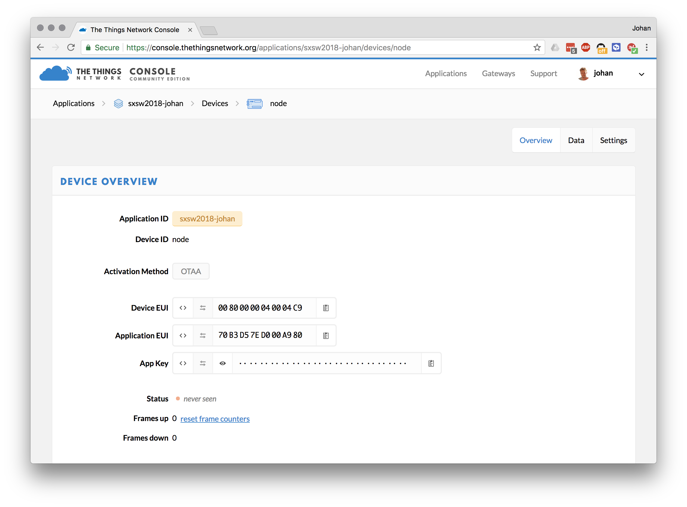
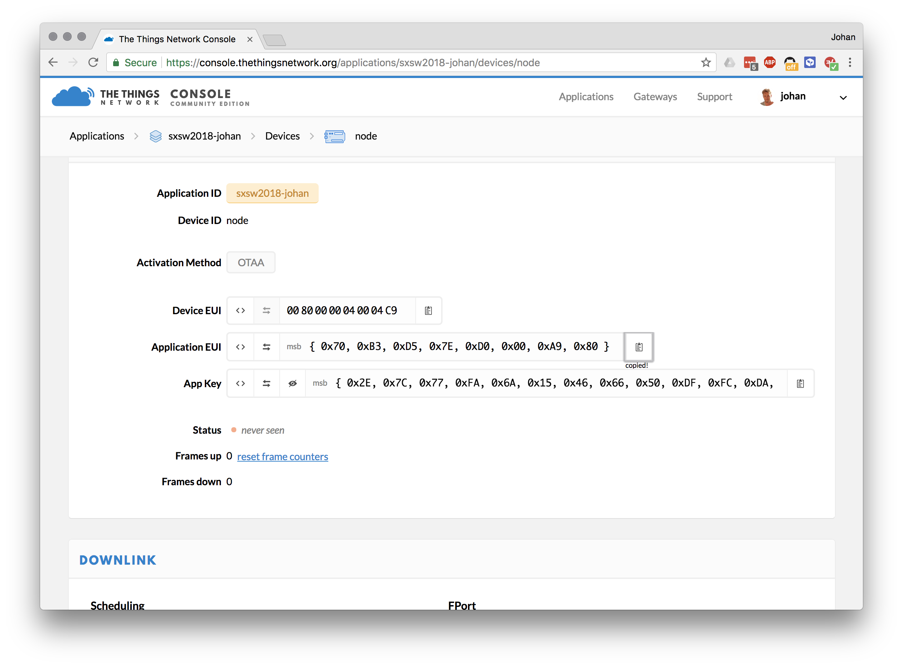
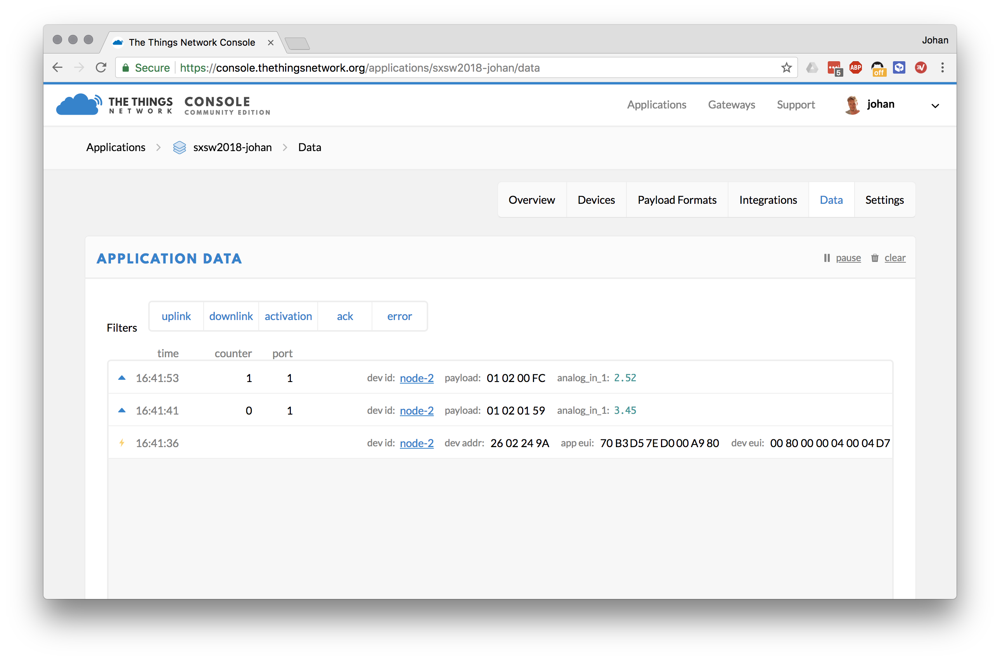

# LoRaWAN workshop - Mbed Connect 2018

In this session we'll introduce you to:

1. Building IoT devices with [Arm Mbed OS](https://os.mbed.com/).
1. Connecting your device to [The Things Network](https://www.thethingsnetwork.org/) using LoRaWAN.
1. Using the The Things Network SDK to get data out.

In case you're stuck this document will help you get back on track. Please help your neighbours as well :-)

## 0. Prerequisites

1. Create an Arm Mbed online account [here](https://os.mbed.com/account/signup/).
1. Create a The Things Network account [here](https://console.thethingsnetwork.org/).
1. Then install the following software for your operating system below.

**Windows**

If you are on Windows, install:

1. [ST Link](http://janjongboom.com/downloads/st-link.zip) - serial driver for the board.
    * Run `dpinst_amd64` on 64-bits Windows, `dpinst_x86` on 32-bits Windows.
    * Afterwards, unplug your board and plug it back in.
    * (Not sure if it configured correctly? Look in 'Device Manager > Ports (COM & LPT)', should list as STLink Virtual COM Port.
1. [Tera term](https://osdn.net/projects/ttssh2/downloads/66361/teraterm-4.92.exe/) - to see debug messages from the board.
1. [Node.js](https://nodejs.org/en/download/) - to show visualizations.

**Linux**

If you're on Linux, install:

1. screen - e.g. via `sudo apt install screen`
1. [Node.js](https://nodejs.org/en/download/) - to show visualizations.

**MacOS**

If you're on MacOS, install:

1. [Node.js](https://nodejs.org/en/download/) - to show visualizations.

## 1. Building the circuit


We're using the [NUCLEO-L476RG](https://os.mbed.com/platforms/ST-Nucleo-L476RG/) development board, a Semtech SX1272 LoRa shield, and a temperature sensor. Let's build a circuit.

Grab the following items:

* Development board.
* LoRa shield.
* Temperature sensor

Then:

1. Click the shield on the board.
1. Connect the temperature sensor to A1 on the shield.
1. Connect the board to your computer.

## 2. LoRaWAN topology

LoRaWAN devices do not connect directly to the internet. They send out radio messages which are picked up by a gateway, and the gateway forwards them to a network server. You can then get a clean, unencrypted data stream from the network.


Today we set up a gateway in the room, which is connected to The Things Network, so all that's left is building a device.

## 3. Connecting to the LoRaWAN network

We've prepared an application that contains Mbed OS and the Mbed LoRaWAN stack. We can compile this application in the Mbed Online Compiler.

1. Go to the [NUCLEO-L476RG](https://os.mbed.com/platforms/ST-Nucleo-L476RG/) platform page.
1. Click **Add to your compiler**.

Then:

1. Go to the [Mbed Online Compiler](https://os.mbed.com/compiler).
1. In the Online Compiler, click *Import*.
1. Click *Click here to import from URL*.
1. Enter `https://github.com/ARMmbed/mbed-connect-2018-lorawan`.
1. Click *Import*.

We need to program some keys in the device. LoRaWAN uses an end-to-end encryption scheme that uses two session keys. The network server holds one key, and the application server holds the other. (In this tutorial, TTN fulfils both roles). These session keys are created when the device joins the network. For the initial authentication with the network, the application needs its device EUI, the EUI of the application it wants to join (referred to as the application EUI) and a preshared key (the application key).

Let's register this device in The Things Network and grab some keys!

### Connecting to The Things Network

#### Setting up

1. Go to [The Things Network Console](https://console.thethingsnetwork.org)
2. Login with your account or click [Create an account](https://account.thethingsnetwork.org/register).

   

   >The Console allows you to manage Applications and Gateways.

3. Click **Applications**
4. Click **Add application**
5. Enter a **Application ID** and **Description**, this can be anything
6. Be sure to select `ttn-handler-us` in **Handler registration**

   

   >The Things Network is a global and distributed network. Selecting the Handler that is closest to you and your gateways allows for higher response times.

7. Click **Add application**

   

   >LoRaWAN devices send binary data to minimize the payload size. This reduces channel utilization and power consumption. Applications, however, like to work with JSON objects or even XML. In order to decode binary payload to an object, The Things Network supports [CayenneLPP](https://www.thethingsnetwork.org/docs/devices/arduino/api/cayennelpp.html) and Payload Functions: JavaScript lambda functions to encode and decode binary payload and JSON objects. In this example, we use CayenneLPP.

8. Go to **Payload Format** and select **CayenneLPP**

   

#### Registering your Device

1. In your application, go to **Devices**
2. Click **Register device**
3. Enter a name.
3. Click the 'Generate' button next to 'Device EUI'.

    

   >You can leave the Application EUI to be generated automatically.

5. Click **Register**

   

   >Your device needs to be programmed with the **Device EUI**, **Application EUI** and **App Key**

7. Click the `< >` button of the **Device EUI**, **Application EUI** and **App Key** values to show the value as C-style array
8. Click the **Copy** button on the right of the value to copy to clipboard

   


#### Pasting them in the Online Compiler

In the Online Compiler now open `main.cpp`, and paste the Device EUI, Application EUI and Application Key in.


**Note:** Do not forget the `;` after pasting.

Now click *Compile* and flash the application to your board again. The board should now connect to The Things Network. Inspect the *Data* tab in the TTN console to see the device connecting. You should first see a 'join request', then a 'join accept', and then data flowing in.



## 4. Showing logs

To see debug messages on the development board, do the following:

#### Windows

Install:

1. [Arm Mbed Windows serial driver](http://os.mbed.com/media/downloads/drivers/mbedWinSerial_16466.exe) - serial driver for the board.
    * See above for more instructions.
    * No need to install this if you're on Windows 10.
1. [Tera term](https://osdn.net/projects/ttssh2/downloads/66361/teraterm-4.92.exe/) - to see debug messages from the board.

When you open Tera Term, select *Serial*, and then select the Mbed COM port.


#### macOS

No need to install a driver. Open a terminal and run:

```
screen /dev/tty.usbm            # now press TAB to autocomplete and then ENTER
```

To exit, press: `CTRL+A` then `CTRL+\` then press `y`.

#### Linux

If it's not installed, install GNU screen (`sudo apt-get install screen`). Then open a terminal and find out the handler for your device:

```
$ ls /dev/ttyACM*
/dev/ttyACM0
```

Then connect to the board using screen:

```
sudo screen /dev/ttyACM0 9600                # might not need sudo if set up lsusb rules properly
```

To exit, press `CTRL+A` then type `:quit`.


## 5. Sending temperature values

Right now we relay random numbers back to the device. Change the code so that it sends the temperature from the temperature. Open `main.cpp`, and under `// YOUR CODE HERE` change the line to:

```cpp
static Grove_temperature tempSensor(A1);
float temperature = tempSensor.getTemperature();
```

Compile and flash the application again to see the changes.

## 6. Getting data out of The Things Network

To get some data out of The Things Network you can use their SDK. Today we'll use the node.js SDK, but there are many more.

First, you need the application ID, and the application key.

1. Open the TTN console and go to your application.
1. Your application ID is noted on the top, write it down.

    

1. Your application Key is at the bottom of the page. Click the 'show' icon to make it visible and note it down.

    

With these keys we can write a Node.js application that can retrieve data from TTN.

1. Open a terminal or command prompt.
1. Create a new folder:

    ```
    $ mkdir mbed-connect-ttn
    $ cd mbed-connect-ttn
    ```

1. In this folder run:

    ```
    $ npm install ttn
    ```

1. Create a new file `server.js` in this folder, and add the following content (replace YOUR_APP_ID and YOUR_ACCESS_KEY with the respective values from the TTN console):

    ```js
    let TTN_APP_ID = 'YOUR_APP_ID';
    let TTN_ACCESS_KEY = 'YOUR_ACCESS_KEY';

    const ttn = require('ttn');

    TTN_APP_ID = process.env['TTN_APP_ID'] || TTN_APP_ID;
    TTN_ACCESS_KEY = process.env['TTN_ACCESS_KEY'] || TTN_ACCESS_KEY;

    ttn.data(TTN_APP_ID, TTN_ACCESS_KEY).then(client => {
        client.on('uplink', (devId, payload) => {
            console.log('retrieved uplink message', devId, payload);
        });

        console.log('Connected to The Things Network data channel');
    });
    ```

1. Now run:

    ```
    $ node server.js
    ```

The application authenticates with the The Things Network and receives any message from your device.

## 7. Pretty graphs


To get some prettier graphs you can use the TTN Sensor Maps application.

1. [Download the application](https://github.com/janjongboom/ttn-sensor-maps/archive/master.zip) and unzip.
1. Open `server.js` and on line 43 change this to:

    ```js
    mapCenter: {
        lat: 37.3290,
        lng: -121.8890
    }
    ```

    And save the file.

1. Open a terminal and navigate to the folder where you un-zipped the application.
1. Run:

    ```
    $ npm install
    $ node server.js
    ```

1. Open a web browser and navigate to http://localhost:7270.

Then:

1. Enter your application ID in the text box.
1. Enter your application Key when prompted.
1. Sensors will now automatically show up on the map.
1. Drag the sensor to the right location.

## 8. You are the network

The Things Network is a collaborative network. You can extend the network yourself by placing a gateway, or you can use existing coverage from community members. See [The Things Network Map](https://www.thethingsnetwork.org/map) to see if there is coverage in your area or region.

Setting up a gateway is easy and becomes more and more affordable. Here are two recommended options:

1. The highly configurable [MultiTech Conduit](https://www.digikey.com/en/product-highlight/m/multi-tech-systems/iot-platform); you need an `MTAC-LORA-915` or `MTAC-LORA-868` depending [on your country](https://www.thethingsnetwork.org/docs/lorawan/frequencies-by-country.html), as well as a `MTCDT` Conduit;
1. The Things Network's own product, [The Things Gateway 915 MHz](http://www.newark.com/productimages/standard/en_US/05AC1807-40.jpg) or [The Things Gateway 868 MHz](http://uk.farnell.com/the-things-network/ttn-gw-868/the-things-gateway-eu/dp/2675813)
